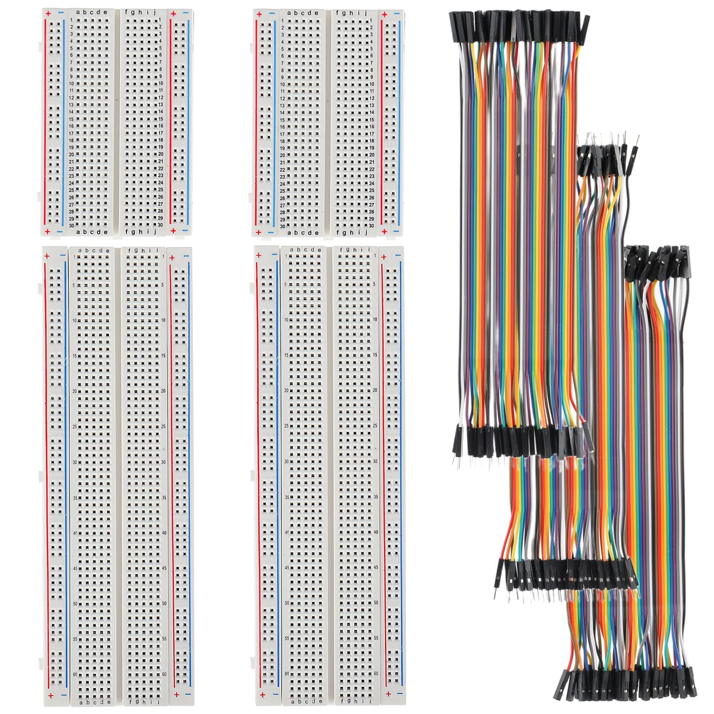
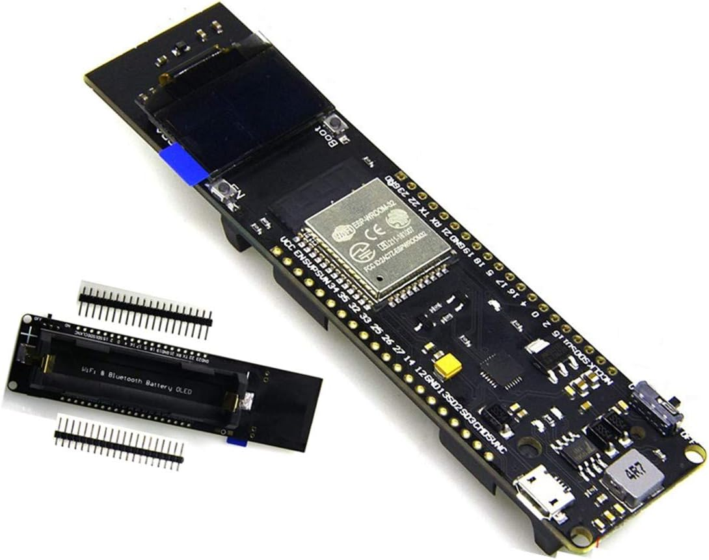
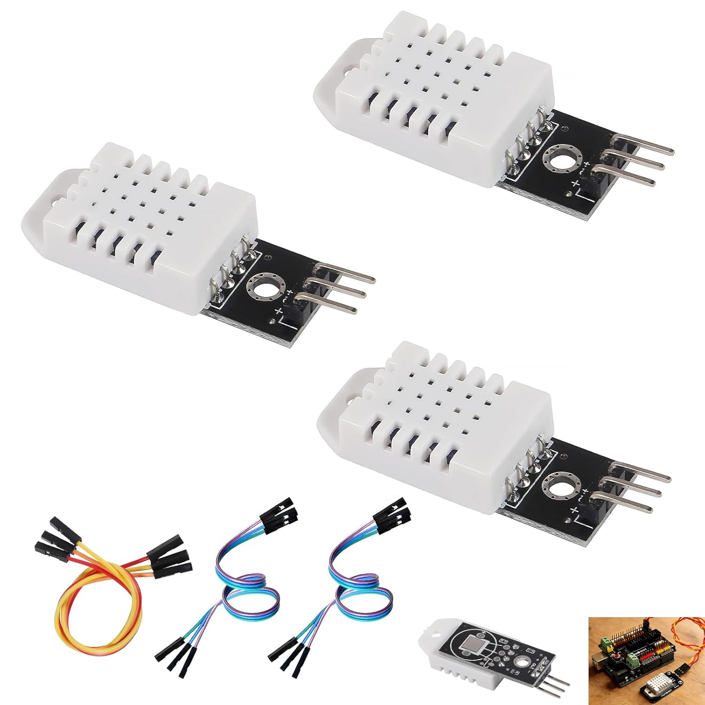
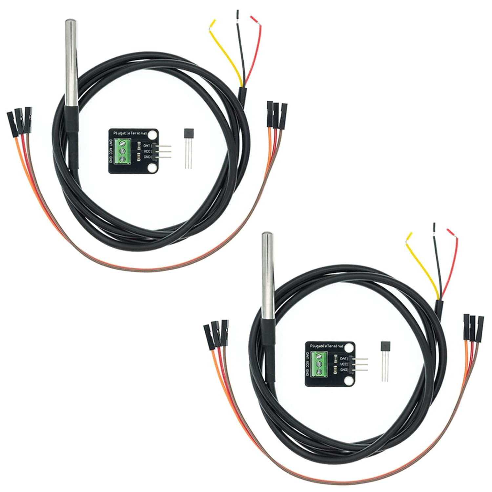
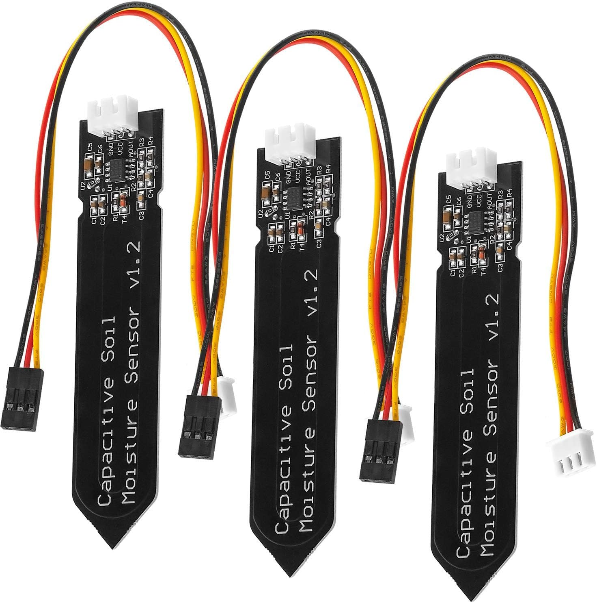

# 🛠️ NOTICE DE MONTAGE - ÉTAPE 1 : Le Puzzle sur le bureau

⚠️ **RÈGLE D'OR :** Ne branche Surtout PAS la batterie ni le câble USB tant que le monsieur sur le dessin n'a pas dit que c'était fini !

### 📦 INVENTAIRE DES PIÈCES POUR CETTE ÉTAPE :
Vide ton carton et pose ces éléments sur ton bureau :
* **[Plaque]** : La plaque d'essai (le rectangle blanc avec plein de trous).
  
* **[Cerveau]** : La carte ESP32 (la carte noire avec le petit écran).
  
* **[Capteur A]** : La station Air (DHT22 - le petit boîtier blanc avec des fentes).
  
* **[Capteur B]** : La sonde Température Terre (le tube en métal Inox au bout d'un fil).
  
* **[Capteur C]** : La sonde Humidité Terre (la grande fourche noire).
  
* **[Fils]** : Une poignée de câbles colorés.
  

---

## 🏗️ ACTION 1 : Poser les fondations
1. Prends la **[Plaque]** blanche et pose-la bien à plat devant toi.
2. Prends le **[Cerveau]** (carte noire). 
3. Regarde en dessous : il y a des petites pointes métalliques. Aligne ces pointes pour que la carte soit posée **pile au centre de la plaque blanche**, à cheval sur le petit fossé central.
4. Appuie fermement (mais doucement) avec tes deux pouces pour enfoncer la carte dans les trous de la plaque.

## 🍝 ACTION 2 : Préparer les fils (L'astuce du chef)
1. Prends le sachet de fils de couleur. Ils sont tous collés ensemble en un grand ruban plat multicolore.
2. **Détache-les !** Tire dessus pour en séparer un **ROUGE** et un **BLEU** (ou noir), exactement comme on effiloche du fromage !
3. **Le bon embout :** Regarde les bouts en plastique noir. Il te faut des fils avec **une petite pointe en métal qui dépasse à chaque extrémité** (pour pouvoir les planter dans les trous de la plaque blanche).

## ⚡ ACTION 3 : Distribuer l'énergie (Créer une multiprise)
*On va envoyer le courant de la carte noire vers les grandes lignes sur les bords de la plaque blanche.*

1. **Le fil 🔴 ROUGE (L'alimentation) :**
   * Regarde la carte noire et cherche l'inscription **3V3** (ou 3.3V).
   * Regarde dans quel trou de la plaque blanche cette petite patte est enfoncée.
   * Plante une pointe de ton fil rouge dans un trou de la plaque blanche **juste à côté, sur la même ligne (la même rangée horizontale)** que cette patte.
   * Plante l'autre pointe de ton fil rouge tout au bord de la plaque, n'importe où sur la **longue ligne ROUGE (+)**.
2. **Le fil 🔵 BLEU (La terre) :**
   * Fais exactement la même chose : cherche l'inscription **GND** sur la carte noire.
   * Plante une pointe du fil bleu juste à côté, sur la même rangée.
   * Plante l'autre pointe tout au bord de la plaque, sur la **longue ligne BLEUE (-)**.

### 🔧 MINI-ÉTAPE SPÉCIALE : Préparer la Sonde Inox
*Avant de brancher la sonde sur la plaque blanche, il faut la relier à son petit adaptateur.*

1. Prends le petit carré noir avec le bloc vert (l'adaptateur).
2. Prends un tout petit tournevis plat et dévisse légèrement les 3 petites vis sur le dessus du bloc vert.
3. Prends le long câble noir de la sonde Inox avec les 3 fils nus au bout (Rouge, Jaune, Noir).
4. Insère les fils dans les petits trous du bloc vert en respectant cet ordre (c'est écrit sur la carte) :
   * Le fil **JAUNE** ➔ Dans le trou **DAT** (Data)
   * Le fil **ROUGE** ➔ Dans le trou **VCC** (+)
   * Le fil **NOIR** ➔ Dans le trou **GND** (-)
5. Revisse fermement les 3 vis pour bloquer les fils.
6. Tu peux maintenant utiliser 3 câbles de couleur fournis dans ton sachet (avec un embout "Femelle" d'un côté et "Mâle" de l'autre) pour relier les 3 pointes métalliques de l'adaptateur vers la plaque blanche et la carte noire, comme expliqué dans la notice !

## ☁️ ACTION 4 : Brancher le Capteur Air [Capteur A]
1. Prends un fil 🔴 ROUGE : Relie la broche **VCC** (ou +) du capteur à la grande ligne rouge de la plaque.
2. Prends un fil 🔵 BLEU : Relie la broche **GND** (ou -) du capteur à la grande ligne bleue de la plaque.
3. Prends un fil 🟡 JAUNE (ou autre couleur) : Relie la broche **DATA** (ou OUT) du capteur au trou numéro **14** de la carte noire.

## 🌡️ ACTION 5 : Brancher la Sonde en Métal [Capteur B]
1. Prends un fil 🔴 ROUGE : Relie le **VCC** (ou +) du capteur à la grande ligne rouge.
2. Prends un fil 🔵 BLEU : Relie le **GND** (ou -) du capteur à la grande ligne bleue.
3. Prends un fil 🟢 VERT (ou autre couleur) : Relie le fil **DATA** (ou Signal) du capteur au trou numéro **4** de la carte noire.

## 💧 ACTION 6 : Brancher la Fourche Noire [Capteur C]
1. Prends un fil 🔴 ROUGE : Relie la broche **VCC** de la fourche à la grande ligne rouge.
2. Prends un fil 🔵 BLEU : Relie la broche **GND** de la fourche à la grande ligne bleue.
3. Prends un fil 🟣 VIOLET (ou autre couleur) : Relie la broche **AOUT** (Signal) de la fourche au trou numéro **34** de la carte noire.

---

**✅ FIN DE L'ÉTAPE 1 !**
Vérifie une dernière fois que tous tes fils rouges sont sur la grande ligne rouge, et tes fils bleus/noirs sur la grande ligne bleue. Si c'est le cas, ton circuit est parfait ! 

**Tu as gagné le droit de brancher le câble USB à l'ordinateur pour passer à l'Étape 2 !**