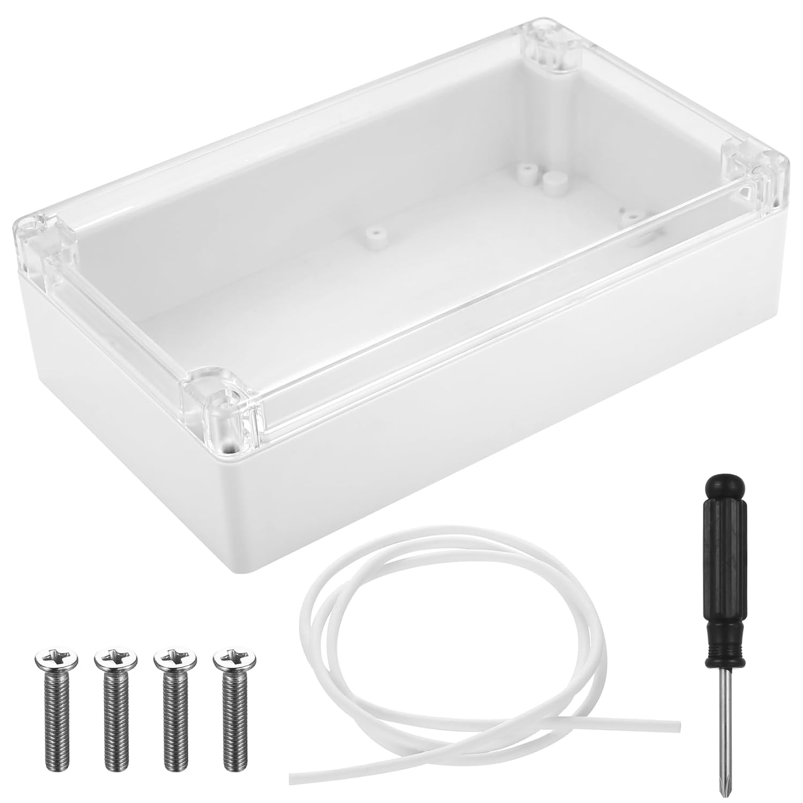
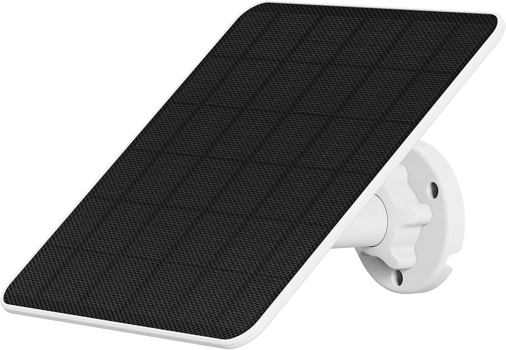

# 🛠️ NOTICE DE MONTAGE - ÉTAPE 4 : La Maison Étanche et le Jardin

⚠️ **RÈGLE D'OR :** C'est le moment de faire très attention au sens de la pile (le + et le -). Si on la met à l'envers, la carte noire fera de la fumée, et ce n'est pas bon signe !

### 📦 INVENTAIRE DES PIÈCES POUR CETTE ÉTAPE :
* **[Le Puzzle]** : Ton circuit qui fonctionne sur le bureau.
  
* **[La Boîte]** : Le grand boîtier de 20 cm avec son couvercle transparent.
  
* **[Les Embouts]** : Les presse-étoupes blancs.
  
* **[L'Énergie]** : La grosse pile JESSPOW et le panneau solaire NIVIAN.
   
* **[Les Outils]** : Une perceuse et un tournevis.
  

---

## 🕳️ ACTION 1 : Faire les trous (Le Bricolage)
*On va préparer la boîte pour laisser entrer les fils, mais pas la pluie.*

1. Prends **[La Boîte]** et choisis le côté qui pointera vers le sol une fois installée dehors.
2. Perce 3 ou 4 trous **uniquement sur ce côté du dessous** (jamais sur le dessus, sinon l'eau va s'infiltrer).
3. Visse tes **[Embouts]** blancs dans les trous. Dévisse le petit chapeau de chaque embout et garde-le sous la main.

## 📦 ACTION 2 : Le Déménagement (Le Piège IKEA ⚠️)
*Il faut rentrer le circuit dans la boîte.*

1. Débranche le câble USB de l'ordinateur.
2. Débranche **uniquement** les fils des capteurs qui vont aller dehors : le tube en métal (Sonde Inox) et la fourche noire (Humidité). Laisse le capteur blanc (Air) branché, il reste à l'intérieur de la boîte.
3. Prends ta plaque blanche (avec la carte noire dessus), décolle l'autocollant en dessous, et **colle-la bien au centre, au fond de la boîte**.
4. **LE PIÈGE :** Prends les fils de la Sonde Inox et de la fourche noire. Passe-les à l'intérieur des petits chapeaux des embouts blancs, puis **glisse-les à travers les trous de la boîte (de l'extérieur vers l'intérieur)**. 
5. Fais pareil avec le câble USB de ton panneau solaire : passe-le de l'extérieur vers l'intérieur.
6. Maintenant que les fils sont dans la boîte, tu peux les rebrancher sur la plaque blanche exactement comme à l'Étape 1. 

## 🛑 ACTION 3 : Sceller les écoutilles !
1. Tire doucement sur les fils depuis l'extérieur pour ne pas avoir un gros paquet de nouilles à l'intérieur de la boîte.
2. Visse et **serre très fort** les chapeaux des embouts blancs. Le caoutchouc va écraser les fils : l'eau ne pourra plus jamais passer !

## 🔋 ACTION 4 : Donner vie au monstre (L'Énergie)
1. Prends la grosse pile **JESSPOW**. Regarde au dos de la carte noire : il y a un support avec un **(+)** et un **(-)** gravés dans le plastique.
2. Insère la pile dans le bon sens. L'écran devrait s'allumer tout de suite !
3. Prends le bout du câble du **panneau solaire** (qui est maintenant dans la boîte) et branche-le sur la prise USB de la carte noire.
4. Pose le couvercle transparent sur la boîte, et serre fermement les 4 vis aux coins.

## 🌻 ACTION 5 : L'Installation au Potager
*Mets tes bottes, on sort !*

1. **Fixer le boîtier :** Accroche ta boîte sur un piquet en bois ou sur le bord de ton bac à légumes.
2. **Le Soleil :** Fixe le panneau solaire juste au-dessus. Règle-le pour qu'il regarde **plein Sud**, incliné vers le ciel à environ 30 ou 35 degrés.
3. **Plonger la Sonde Inox :** Enfonce le tube en métal profondément dans la terre (environ 10 à 15 cm, là où sont les racines des tomates).
4. **Planter la Fourche Noire :** Plante le capteur d'humidité dans la terre. **ATTENTION :** N'enterre que la grande partie noire. La petite partie en haut (où les fils sont soudés) n'aime pas l'eau et doit rester à l'air libre !

---

**🏆 SUCCÈS DÉVERROUILLÉ : "Hacker Agricole"**
C'est terminé ! Ta station est 100% autonome et va envoyer ses relevés en continu. Tu peux retourner t'asseoir dans le canapé et surveiller tes tomates depuis ton téléphone !